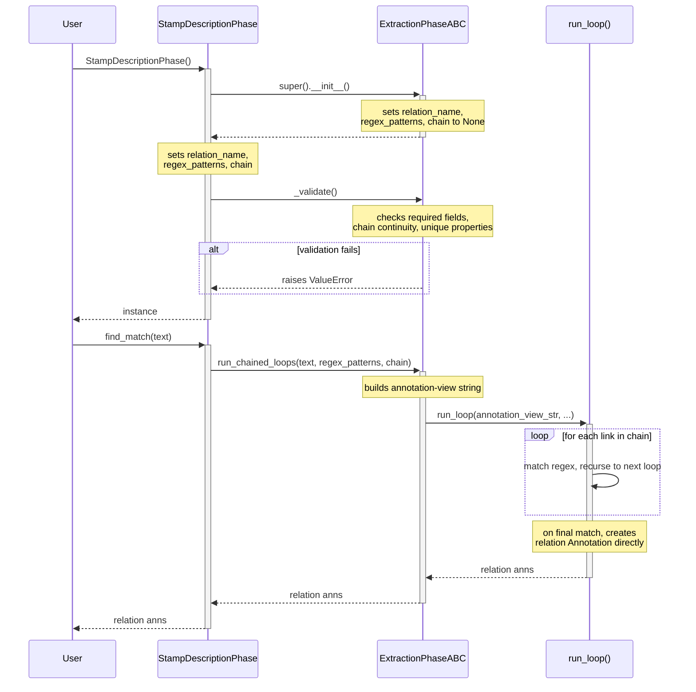

# Relation Extraction: How It Works

The diagram below shows the sequence of classes and functions involved when
extracting relations using `ExtractionPhaseABC`. The stamp description example
(`examples/extract_stamp_description.py`) is used as the reference case.

To use the framework, subclass `ExtractionPhaseABC` and in `__init__` set three
instance variables:
- `self.relation_name`: the string type name for extracted relations (e.g. `'StampDescription'`)
- `self.regex_patterns`: a dict mapping entity type names to `RegexString` objects
- `self.chain`: a list specifying the allowed token distance between consecutive entity types

Calling the subclass constructor (e.g. `StampDescriptionPhase()`) creates an instance that holds `regex_patterns`, `chain`, and `relation_name`. The caller then splits the input text as needed and calls the base-class `find_match(text)` on that instance for each segment.

**The annotation-view string**: During processing, `run_chained_loops()` converts the raw text segment into a string held in the variable `annotation_view_str`: it is a flat string in which each recognized entity span is replaced by a structured tag, and every remaining token becomes a generic `Token` tag. `run_loop()` then applies its proximity regexes against this string rather than the original text. For the first stamp entry, the `annotation_view_str` looks like the following (formatted here one tag per line; the actual string is one continuous sequence):

```
<'StampID'(text='# 11A', start='0', end='5')>
<'Token'(text='-', start='6', end='7', kind='punc')>
<'Token'(text='1853', start='8', end='12', kind='word')>
<'Token'(text='-', start='12', end='13', kind='punc')>
<'Token'(text='55', start='13', end='15', kind='word')>
<'Denomination'(text='3¢', start='16', end='18')>
<'Token'(text='George', start='19', end='25', kind='word')>
<'Token'(text='Washington', start='26', end='36', kind='word')>
<'Token'(text=',', start='36', end='37', kind='punc')>
<'Token'(text='dull', start='38', end='42', kind='word')>
<'Token'(text='red', start='43', end='46', kind='word')>
<'Token'(text=',', start='46', end='47', kind='punc')>
<'TypePhrase'(text='type II', start='48', end='55')>
<'Token'(text=',', start='55', end='56', kind='punc')>
<'Perforation'(text='imperf', start='57', end='63')>
```

<br>


